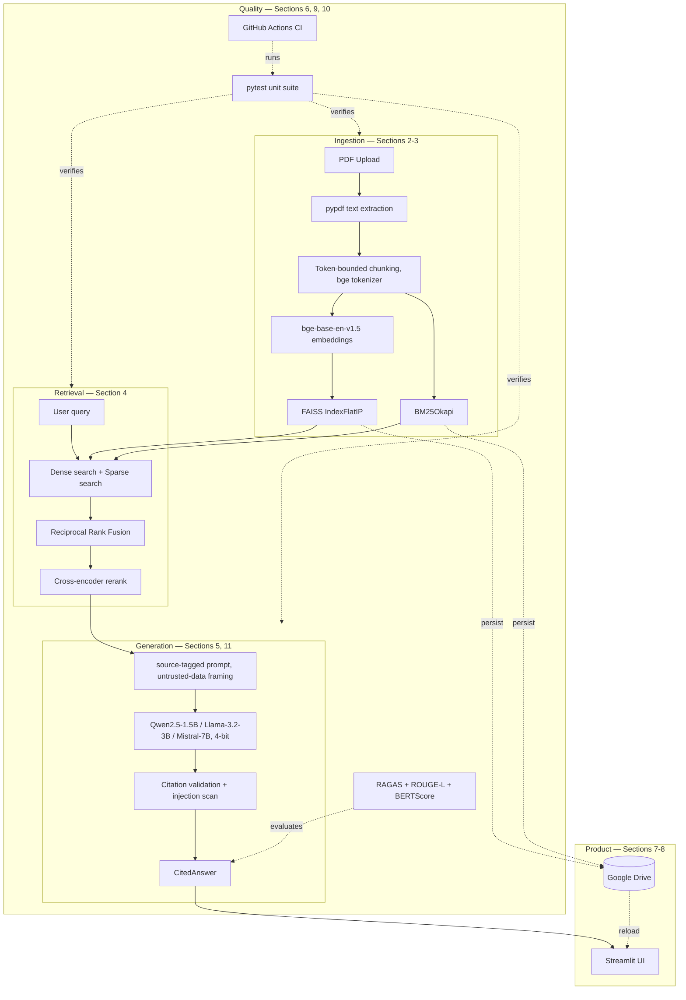

# DocuMind

Upload a PDF, ask questions about it in plain English, get cited answers
grounded in the actual document — not a model's guess.


## What it does

DocuMind is a retrieval-augmented generation (RAG) system for document
question-answering. It combines dense (FAISS) and sparse (BM25) retrieval,
reranks candidates with a cross-encoder, and generates answers with
open-source LLMs — every claim cited back to a specific page in the
source document, with programmatic validation that citations are real,
not invented.

## Key features

- **Hybrid retrieval**: dense semantic search + sparse keyword search,
  fused with Reciprocal Rank Fusion — covers both paraphrase-style and
  exact-match queries.
- **Cross-encoder reranking** for final relevance ordering.
- **Cited, grounded answers**: every claim gets a `[N]` citation,
  programmatically checked against the real source list — invented
  citations are caught and flagged, not silently trusted.
- **Three interchangeable open-source LLMs** (Qwen2.5-1.5B, Llama-3.2-3B,
  Mistral-7B), 4-bit quantized, evaluated side by side with RAGAS,
  ROUGE-L, and BERTScore.
- **Prompt-injection defenses**: retrieved document content is
  structurally isolated from instructions in the prompt, scanned for
  suspicious patterns, and answers are checked for signs an injection
  succeeded.
- **Persistent document library**: index once, reload across sessions —
  no need to re-embed a document you've already processed.
- **Tested and CI-gated**: a fast unit suite (no GPU/network required)
  runs automatically on every push via GitHub Actions.
- **Latency and throughput instrumentation**: per-query timing and
  tokens/sec, surfaced in the UI and in model-comparison reports —
  quality metrics alone don't answer "which model would you deploy."
- **Centralized, env-driven configuration** and **upload size/page
  count limits**, so tuning and reliability guardrails live in one
  documented place instead of scattered constants.

## Architecture



## Tech stack

| Layer | Choice |
|---|---|
| Dev environment | Google Colab |
| Deployment | Streamlit |
| Orchestration | LangChain |
| Embeddings | BAAI/bge-base-en-v1.5 |
| Dense retrieval | FAISS |
| Sparse retrieval | rank-bm25 |
| Reranking | cross-encoder/ms-marco-MiniLM-L-6-v2 |
| Generation | Qwen2.5-1.5B, Llama-3.2-3B, Mistral-7B |
| Evaluation | RAGAS, ROUGE-L, BERTScore |
| Storage | Google Drive |
| Testing / CI | pytest, GitHub Actions |

## Getting started

1. **Environment setup** (Colab): install dependencies and verify the
   environment:
   ```bash
   pip install -r requirements.txt
   python verify_environment.py
   ```
2. **Run the app locally**:
   ```bash
   pip install -r requirements.txt
   streamlit run app.py
   ```
3. **Run the fast test suite** (no GPU/model download required):
   ```bash
   pip install -r requirements-test.txt
   pytest -v
   ```

## Project structure

```
.
├── app.py                  # Streamlit UI (Section 7)
├── pdf_ingestion.py         # PDF loading + chunking (Section 2)
├── indexing.py               # Embedding + FAISS/BM25 index (Section 3)
├── retrieval.py               # Hybrid retrieval + reranking (Section 4)
├── generation.py               # Cited answer generation (Section 5, 11)
├── evaluation.py                 # RAGAS/ROUGE-L/BERTScore (Section 6)
├── storage.py                     # Persistence + document library (Section 8)
├── security.py                     # Prompt-injection defenses (Section 11)
├── observability.py                 # Latency + throughput instrumentation (Section 13)
├── config.py                          # Centralized tunable configuration (Section 14)
├── .env.example                        # Documented environment variables (Section 14)
├── .streamlit/config.toml               # Upload size limit (Section 15)
├── conftest.py                      # Shared test fixtures (Section 9)
├── test_*.py                         # Unit tests (Section 9)
├── requirements.txt                   # Full dependency set
├── requirements-test.txt               # Minimal CI dependency set (Section 10)
└── .github/workflows/tests.yml          # CI workflow (Section 10)
```

## Evaluation results

*Not yet run against a real document/question set — Section 6 built the
harness (RAGAS faithfulness/relevancy/context metrics, ROUGE-L,
BERTScore), but no numbers are reported here until it's actually been
run. Filling in fabricated scores would defeat the point of having a
real evaluation framework.*

| Model | Faithfulness | ROUGE-L F1 | BERTScore F1 | Avg. Generation Time | Tokens/sec |
|---|---|---|---|---|---|
| Qwen2.5-1.5B | _pending_ | _pending_ | _pending_ | _pending_ | _pending_ |
| Llama-3.2-3B | _pending_ | _pending_ | _pending_ | _pending_ | _pending_ |
| Mistral-7B | _pending_ | _pending_ | _pending_ | _pending_ | _pending_ |

## Limitations

- **No OCR support** — scanned/image-only PDFs with no text layer aren't
  supported (Section 2).
- **RAGAS's LLM-judged metrics** are only as reliable as the judge model
  used; a small open-source judge is a noisier signal than a
  frontier-model judge (Section 6).
- **Prompt-injection defenses are layered mitigation, not a guarantee** —
  documented false positives and false negatives exist by design
  (Section 11).
- **`IndexFlatIP` is exact but O(n)** — a deliberate choice at this
  project's scale; would need an approximate index (IVF/HNSW) at
  100k+ chunk scale (Section 3).
- **No combined cross-file upload limit** — each uploaded file is
  checked independently for size/page count (Section 15); uploading
  many files each just under the limit isn't separately capped.

## Candidate future work

- Docker containerization for deployment.

## License

Recommended: MIT (permissive, standard for portfolio repositories) —
replace this section with your actual choice.
